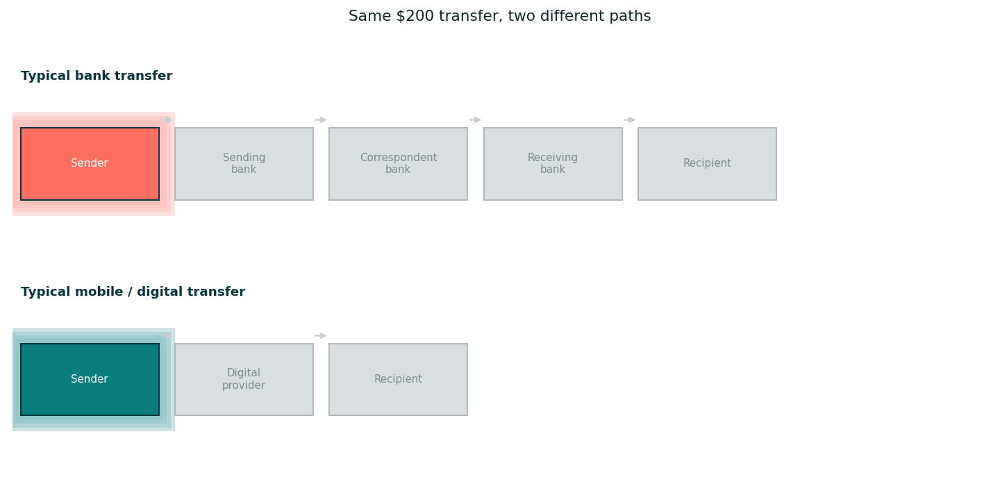
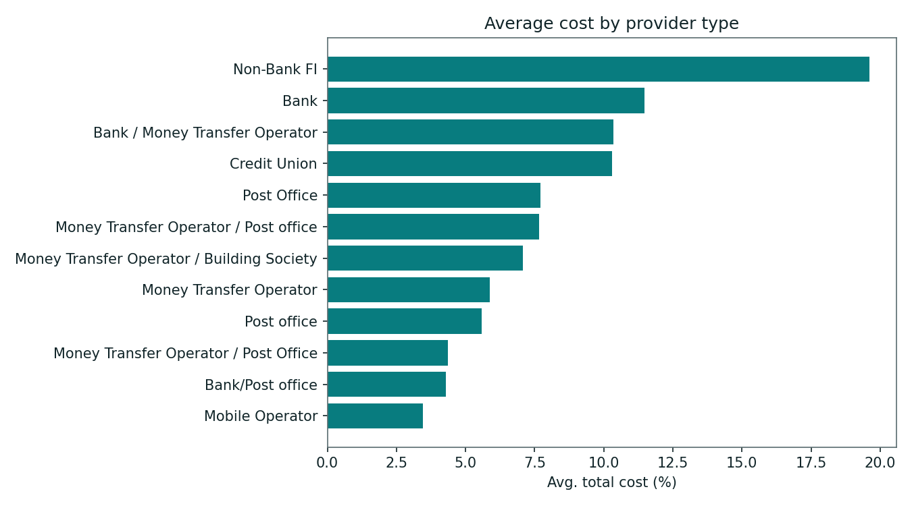
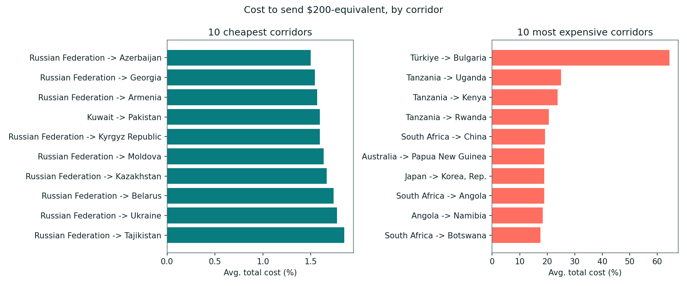
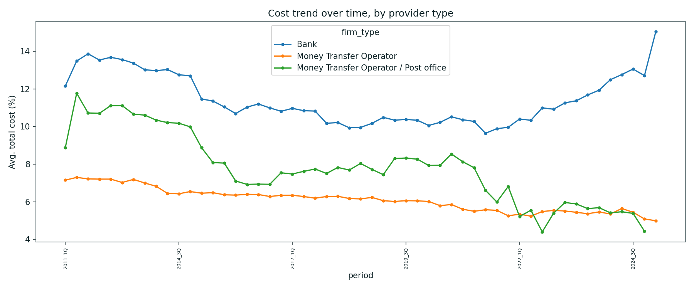
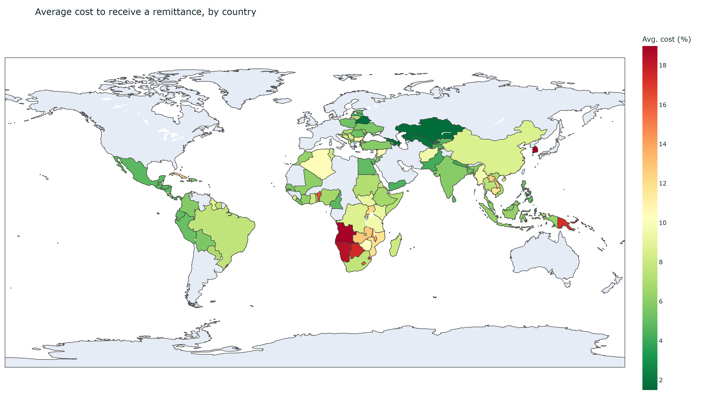
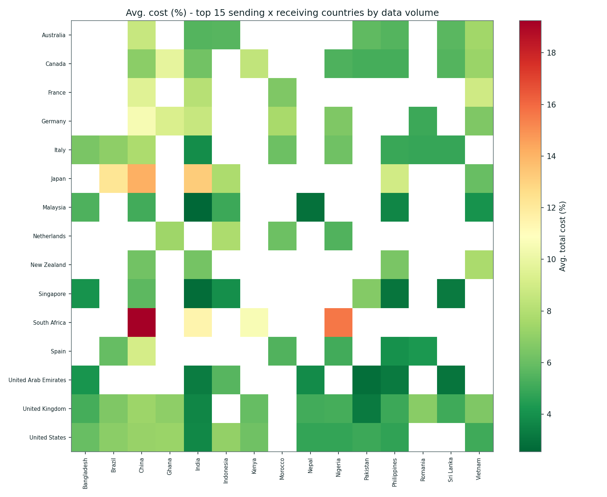
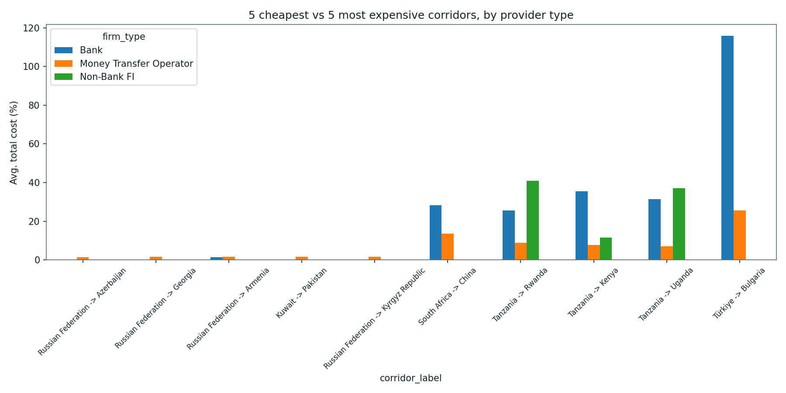

<!--
LinkedIn write-up of this project's findings. LinkedIn posts don't render Markdown
or pull images from GitHub links, so when posting: copy the text below into the post
composer (the image/link markdown lines won't render there - just skip over them)
and attach the actual files from outputs/ as native image/GIF uploads at the
matching points. If you want a shorter native post, lead with chart7's animated
GIF, chart2 (provider comparison) and chart6 (the map) - those three carry the
whole argument on their own; the rest is worth keeping in this file and the GitHub
repo for anyone who reads on. The "interactive version" links only work once
pushed to GitHub - they route through htmlpreview.github.io since GitHub won't
run .html files inline itself.
-->

# Why does it still cost more than 9% to send money to Kenya?

I analysed 247,000+ price quotes from the World Bank's Remittance Prices Worldwide
dataset (2011-2025) to understand what actually drives the cost of sending money
across borders. One number stood out: sending the equivalent of $200 to Kenya costs
9.26% on average across the whole dataset, and 9.73% in the most recent data
(2023-2025) — still roughly 3x the UN's Sustainable Development Goal target of 3%,
despite a decade of "fintech disrupting remittances" headlines.

This project started with Banking Circle's focus on cross-border payments
infrastructure — it's the exact problem their business exists to solve. I wanted
to understand it properly rather than just read about it, so I went and did the
research myself.

## How does a cross-border payment actually work?

When you send money abroad, it doesn't physically move anywhere. Your provider
debits your account, converts your currency into the recipient's currency at
whatever exchange rate it's offering, and instructs a partner in the destination
country to pay the recipient out of its own funds there. What differs between
providers is how many parties sit in that middle step, and what each one charges
to be there.

Banks don't have a direct relationship with every bank in every country, so a
transfer is usually routed through one or more "correspondent banks" —
intermediaries that do have relationships on both ends. Each one takes a small
fee and applies its own exchange-rate margin before passing the payment along.
Mobile-money and digital-first providers mostly skip this chain: they hold
pre-funded local-currency balances in each market they operate in, so a transfer
is closer to an internal ledger entry than a message travelling through several
banks. Fewer intermediaries generally means a cheaper, faster transfer — which is
exactly the pattern in the data below.

*(static version: `outputs/chart7_payment_flow_diagram.png`)*

## The global picture

Split by provider type across the whole dataset, not just Kenya, the pattern
holds everywhere: Mobile Operators average 3.4%, Money Transfer Operators 5.9%,
Banks 11.5%, and Non-Bank FIs 19.6%. Banks cost roughly **2x** a typical MTO, and
for Kenya specifically the bank-to-mobile gap widens to **4.5x** (23.6% vs 5.1%).

*[Interactive version, hover for exact values](https://htmlpreview.github.io/?https://github.com/sarayurkotha/cross-border-payment-cost-analyser/blob/main/outputs/chart2_provider_comparison.html)*

**1. Correspondent banking adds hops, and every hop takes a cut.** That's the
mechanism in the diagram above, and it's the single biggest reason the Bank bar
above towers over the other three.

**2. The real cost is often hidden in the exchange rate, not the fee.** The World
Bank's own methodology (which this analysis uses) captures the *total* cost of a
transfer — the visible fee plus the FX margin embedded in whatever exchange rate
you're actually given. Banks in this dataset frequently look competitive on the
fee line and then take their margin back on the rate. This is exactly why
"no transfer fee" offers can still be expensive.

**3. De-risking has thinned out the competitive field.** Rising AML/compliance
costs have made many global banks pull back correspondent relationships in
smaller or higher-risk markets over the last decade — a pattern regulators call
"de-risking." Fewer banks willing to serve a corridor means less competitive
pressure on the ones that remain, which shows up as durably high bank costs on
corridors that never developed deep alternative rails.

**4. Where digital rails have scale, they win decisively.** Kenya is the
clearest example in the dataset: M-Pesa's home market has enough mobile-money
volume and competing MTOs that the digital/MTO price (5-7%) has stayed well
below the bank price (23.6%) for years. Corridors without that scale don't get
the same competitive discipline.

## Which corridors are cheapest and most expensive?

*[Interactive version, hover for exact values](https://htmlpreview.github.io/?https://github.com/sarayurkotha/cross-border-payment-cost-analyser/blob/main/outputs/chart1_top_corridors.html)*

The 10 cheapest corridors are dominated by Russia's near neighbours — Russian
Federation to Azerbaijan, Georgia, Armenia, Kyrgyz Republic, Moldova, Kazakhstan,
Belarus, Ukraine and Tajikistan all sit under 2%. The most expensive corridor,
Türkiye to Bulgaria at 64.5%, is a genuine outlier worth explaining rather than
just reporting.

*[Interactive version, hover for exact values](https://htmlpreview.github.io/?https://github.com/sarayurkotha/cross-border-payment-cost-analyser/blob/main/outputs/chart3_cost_trend.html)*

That 64.5% average is driven almost entirely by the Bank channel on that specific
corridor, which climbed from ~50-90% in late 2022 to over 200-290% by early 2025
— tracking Türkiye's lira depreciation over the same period — while Money
Transfer Operators on the identical corridor mostly stayed under 30% throughout.
Same corridor, same underlying transfer: the FX-margin mechanism in point 2 just
gets far more extreme when the local currency is volatile. Excluding this one
corridor, the next most expensive (Tanzania to Uganda) sits at a much more
typical 24.9%.

## Where in the world is this cheapest and most expensive?

*[Interactive version, hover any country for its exact average and observation count](https://htmlpreview.github.io/?https://github.com/sarayurkotha/cross-border-payment-cost-analyser/blob/main/outputs/chart6_choropleth.html)*

Shading every receiving country by its average cost makes the geography obvious.
The cheapest places to receive money into are Azerbaijan, Georgia, Kazakhstan,
Belarus and Uzbekistan (all under 2%) — the same near-Russia cluster visible in
the corridor ranking above. The most expensive are Korea Rep. (19.0%), Angola
(19.0%), Namibia (18.3%), Botswana (17.5%) and Eswatini (17.4%). Southern Africa
in particular stands out as a visibly red region on the map, distinct from the
rest of Sub-Saharan Africa.

*[Interactive version, hover for exact values](https://htmlpreview.github.io/?https://github.com/sarayurkotha/cross-border-payment-cost-analyser/blob/main/outputs/chart4_corridor_heatmap.html)*

Zooming into the highest-volume corridors specifically (above), the same divide
holds at a finer grain: sending *from* Malaysia, Singapore, or the UAE is
consistently cheap (dark green into nearly every destination shown), while South
Africa is the one sending country that's expensive almost everywhere it appears
— up to 19% into China specifically, and orange (~14-15%) into Nigeria.

*[Interactive version, hover for exact values](https://htmlpreview.github.io/?https://github.com/sarayurkotha/cross-border-payment-cost-analyser/blob/main/outputs/chart5_cheapest_vs_expensive.html)*

Putting the cheapest and most expensive corridors side by side, split by
provider, makes the pattern concrete: on the cheap corridors, Bank and MTO
prices are close together and both low. On the expensive corridors, Bank pulls
sharply away from MTO every time — the gap, not just the level, is what makes a
corridor expensive.

## The takeaway

None of this is really a story about apps versus branches. It's a story about
correspondent-banking structure, FX-margin transparency, and compliance
economics — and it's fully visible in 15 years of publicly available World Bank
data if you know where to look.

Full analysis, code, and interactive map: [github.com/sarayurkotha/cross-border-payment-cost-analyser](https://github.com/sarayurkotha/cross-border-payment-cost-analyser)

*Data: World Bank, Remittance Prices Worldwide, available at
http://remittanceprices.worldbank.org*
