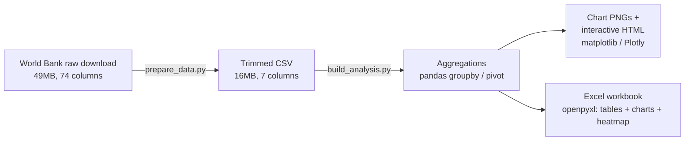

# Cross-Border Payment Cost Analyser

Analysing the cost and efficiency of international remittance corridors using the
World Bank's **Remittance Prices Worldwide** dataset (247k+ price quotes, 2011-2025) —
identifying which corridors are most expensive, why, and how banks compare to money
transfer operators and other provider types.

## Data source

[World Bank Remittance Prices Worldwide](https://remittanceprices.worldbank.org/) —
quarterly survey of remittance costs across global sending/receiving country pairs.
The portal's download page sits behind a browser session (no stable static file URL),
so this repo works from a snapshot downloaded manually.

- `data/raw/remittance_prices_raw.xlsx` — full raw workbook as downloaded (41-74
  columns across two dataset sheets, ~247k rows, 49MB). **Not committed to git** —
  gitignored to keep the repo lightweight. Get your own copy from the link above if
  you want to regenerate the trimmed data from scratch.
- `data/remittance_prices_selected_columns.csv` — **committed**, trimmed to only the
  7 columns this analysis uses (`period`, `source_name`, `destination_name`,
  `destination_code`, `firm_type`, `corridor`, `total_cost_pct`), cutting the file
  from 49MB to ~16MB. `destination_code` (ISO 3166-1 alpha-3) is the one column kept
  purely for the choropleth map - Plotly needs a country code, not a name, to place
  shading correctly. Regenerate it from the raw file with `python src/prepare_data.py`.
- Cost metric used: total cost of sending the equivalent of $200 (`cc1 total cost %`
  in the raw file) — this is the same basis the World Bank uses for its own SDG 10.c
  remittance-cost indicator.

## Pipeline

Two scripts, run in order, take the raw download all the way to charts and a
workbook - nothing in between is done by hand.



Each box is one step you can run and inspect on its own — `prepare_data.py` only
trims columns, `build_analysis.py` only aggregates and charts. The README and
ARTICLE.md are written by hand on top of these outputs, not generated by the
pipeline itself.

## Analysis

Built as a reproducible Python pipeline (`src/build_analysis.py`, pandas + openpyxl +
matplotlib) rather than manual point-and-click, so the whole analysis reruns from raw
data in one command. It produces both a native Excel workbook (tables + charts +
conditional-formatting heatmap — same output a PivotTable-based workflow would give)
and standalone PNG chart exports for the README/LinkedIn. A minimum of 5 observations
per corridor/group is enforced throughout so a single one-off quote can't distort an
average.

1. **Top/bottom corridors** — average cost by sending + receiving country pair,
   surfacing the 10 most and 10 least expensive corridors.
2. **Cost by provider type** — average cost across all corridors, grouped by firm
   type (Bank / Money Transfer Operator / Mobile Operator / etc.).
3. **Cost trend over time** — global average cost by quarter, 2011-2025, split by
   the 3 most common provider types.
4. **Corridor heatmap** — sending x receiving country matrix (top 15 of each by
   data volume, for legibility) with a green-to-red colour scale on average cost.
5. **Cheapest vs most expensive corridors** — the 5 cheapest and 5 most expensive
   corridors side by side, split by provider type.
6. **Choropleth map** — every receiving country shaded by its average cost across
   all sending corridors and providers, built with Plotly (Excel can't draw a real
   geographic map on its own without Power BI or a similar add-in). Static PNG for
   the README plus an interactive HTML version with hover tooltips.

Workbook: `analysis/CrossBorderPayments_Analysis.xlsx`

## Findings

- **Cheapest corridors are dominated by Russia's near neighbours** — Russian
  Federation to Azerbaijan (1.50%), Georgia, Armenia, Kyrgyz Republic, Moldova,
  Kazakhstan, Belarus, Ukraine and Tajikistan fill 9 of the 10 cheapest corridors,
  all under 2%.
- **Most expensive corridor is an outlier worth explaining, not just reporting**:
  Türkiye to Bulgaria averages 64.5% across 131 quotes (2022 Q3-2025 Q1) — but that
  average is driven almost entirely by the Bank channel, which climbed from ~50-90%
  in late 2022 to over 200-290% by early 2025, while Money Transfer Operators on the
  same corridor mostly stayed in the 5-30% range throughout. That timing lines up
  with Türkiye's lira depreciation and high inflation over the same period. Excluding
  this corridor, the next most expensive (Tanzania to Uganda) sits at 24.9% — a much
  more typical "expensive corridor" figure.
- **Provider type is the single biggest cost driver**: Mobile Operators average
  3.4% and Money Transfer Operators 5.9%, versus Banks at 11.5% and Non-Bank FIs at
  19.6% — banks cost roughly 2x a typical MTO for the same transfer.
- **Overall**: median cost across all 247k quotes is 5.36% (mean 6.95%, pulled up by
  a long tail of expensive bank quotes) — still well above the UN SDG target of 3%.
- **Geography**: the choropleth makes the cheap/expensive split visible at a glance.
  Cheapest countries to *receive* into are Azerbaijan, Georgia, Kazakhstan, Belarus
  and Uzbekistan (all under 2%) — the same near-Russia cluster as the cheapest
  corridors above. Most expensive are Korea Rep. (19.0%), Angola (19.0%), Namibia
  (18.3%), Botswana (17.5%) and Eswatini (17.4%) — Southern Africa stands out as a
  visibly red region on the map, distinct from the rest of Sub-Saharan Africa.

## Article

[Why does it still cost more than 9% to send money to Kenya?](ARTICLE.md) — a
write-up of these findings aimed at a LinkedIn audience, explaining the structural
reasons behind corridor cost (correspondent banking, FX margins, compliance costs)
using this dataset to illustrate each one.

## Outputs

Chart exports referenced in this README and the article live in `outputs/`:

- `chart1_top_corridors.png`
- `chart2_provider_comparison.png`
- `chart3_cost_trend.png`
- `chart4_corridor_heatmap.png`
- `chart5_cheapest_vs_expensive.png`
- `chart6_choropleth.png` + `chart6_choropleth.html` — the `.html` version is
  interactive (hover any country for its exact value), but only works if you
  download it and open it locally; GitHub serves `.html` files as plain text
  rather than rendering them, so it won't work from a browser tab pointed at
  the GitHub page itself
- `chart7_payment_flow_diagram.png` — plain-English explainer of why a bank
  transfer and a digital transfer end up costing such different amounts
- `chart7_payment_flow_animation.gif` — the same explainer animated, each block
  lighting up in sequence to show the money moving through the chain

## Reproducing this analysis

```bash
pip install pandas openpyxl matplotlib plotly kaleido
# 1. Download the raw workbook from remittanceprices.worldbank.org/data-download
#    and place it at data/raw/remittance_prices_raw.xlsx
python src/prepare_data.py     # -> data/remittance_prices_selected_columns.csv
python src/build_analysis.py   # -> outputs/*.png/*.html + analysis/CrossBorderPayments_Analysis.xlsx
```

## Repository structure

```
README.md
ARTICLE.md
data/
  raw/                                    (gitignored - not committed)
    remittance_prices_raw.xlsx
  remittance_prices_selected_columns.csv
src/
  prepare_data.py
  build_analysis.py
analysis/
  CrossBorderPayments_Analysis.xlsx
outputs/
  chart1_top_corridors.png / .html
  chart2_provider_comparison.png / .html
  chart3_cost_trend.png / .html
  chart4_corridor_heatmap.png / .html
  chart5_cheapest_vs_expensive.png / .html
  chart6_choropleth.png / .html
  chart7_payment_flow_diagram.png
  chart7_payment_flow_animation.gif
```
